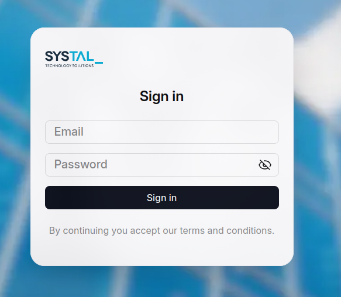
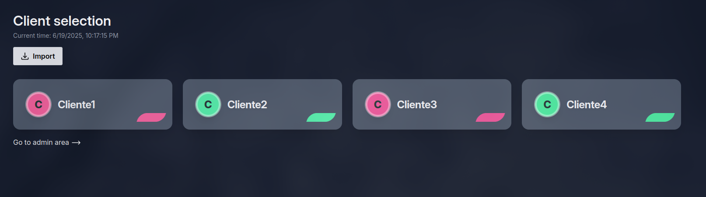
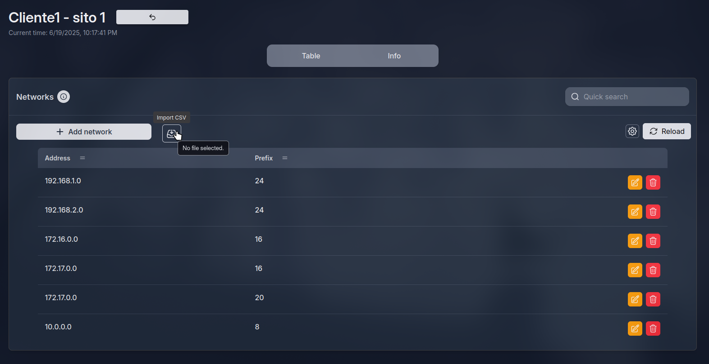
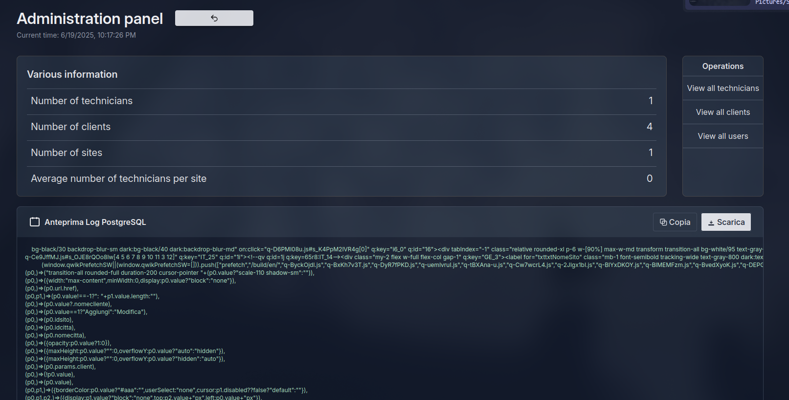

# IPNova

The modern solution to IP management

---

<style scoped>
  span{
    font-size: 30px;
    letter-spacing: 1px;
  }
</style>

## 🧐 What is it?


<span>
IPNova is a special kind of IPAM (IP Address Management) — a tool that helps manage multiple networks easily and efficiently.

The key features of this software include:

- 🔄 CRUD operations for networks and IP addresses

- 🏗️ Building a hierarchy (pyramid) of networks, each with its own properties

- 👨‍💼👩‍💼 Multiple access levels: Admin, Central Agency Technician, and Client

This IPAM is designed specifically for organizations managing clients’ sites and datacenters — with scalability and clarity in mind.
</span>

---

## 💡 Why use it?

The main reason to use an IPAM is its quick access to organized network data — which is crucial for diagnostics 🧠🔍.
IPNova is built to be:

- ⚡ Fast

- 🧭 Intuitive

- 📚 Easy to learn

---

# 🛠️ What do we use?

A short list about what we used to create our site!

---


## 🖼️ Front-end

We use Qwik.js, a lightning-fast ⚡ framework. It boosts performance by skipping hydration and only loads functions when needed — meaning super-fast page loads 🚀.


---

## 🖼️ Front-end

It’s similar to React in structure, using TypeScript-based components you can fully customize 🧩.

For the design we used Figma and later developed with Tailwindcss 🎨. 
Here the mockup link: https://www.figma.com/proto/140HyfKtxB1QSIJjT4UIlm


---

### 🗄️ Back-end

Qwik.js also supports server-side functions directly inside components, making it an all-in-one full-stack framework.

Features:

- 🧬 Route creation based on folder structure

- 🌐 Built-in support for API endpoints

- 🧱 Middleware inside components


---

### 💾 Database

We use PostgreSQL, a robust SQL-based Relational Database Management System (RDBMS) — perfect for the strict structure of networks. 

It runs in a Docker container 🐳 for easy deployment and efficiency. This is important for an IPAM as it allows for:

- 🔒 Secure data storage
- 📊 Fast data retrieval
- 📈 Scalability

---

### 🕒 Time management

We're a small but mighty team of two 💪👨‍💻 working on this project.

We manage tasks using Jira 🗂️ — an Atlassian tool that supports AGILE methodologies:

- ⏱️ Sprint-based task planning

- 🎫 Tickets for modular work

- 👥 Clear communication between devs and the commissioner


---

# 🚀 How to start it?

Let’s get this app running!

---

## 🌍 Run the site

Clone the repo:

```shell
git clone https://github.com/IPAM-website/ipam.git
```

Install dependencies:

```shell
pnpm i
```

Start development mode:

```shell
pnpm dev
```

---

Preview production mode:

```shell
pnpm preview
```

Add a static adapter:
```shell
pnpm run qwik add express
```


Build the site:

```shell
pnpm build
```
<br>
The output will be in the dist/ folder 📁.

---

<style scoped>
  .muted{
    color: #999;
    font-size: 24px;
    font-style: italic;
  }
</style>

## 🐘 Run the DB

We use Postgres inside a Docker container.

<p class="muted">🔧 Install Docker Desktop (Windows) or dockerd (Linux) beforehand!</p>

Create a .env file in your project root:

```env
POSTGRES_HOST=localhost
POSTGRES_PORT=5432
POSTGRES_USER=your_user
POSTGRES_PASSWORD=your_password
POSTGRES_DB=your_db_name
```

---

Start the DB container:

```shell
docker-compose up
```

If you get an error about a missing image, install it manually:

```shell
docker pull postgres:17-alpine
```

<br>

And you are ready to go!

---

<style scoped>
img[alt~="center"] {
  position: relative;
  left: 25%;
}
</style>

# 📊 Site Overview

---

Our Login page with 2FA:



---

<style scoped>
img[alt~="descale"] {
  width: 1100px;
}
</style>

Dashboard:



---

<style scoped>
img[alt~="descale"] {
  transform: scale(0.7);
  position:relative;
  top:-120px;
  left:-200px;
}
</style>

Networks:



---

<style scoped>
img[alt~="descale"] {
  transform: scale(0.7);
  position:relative;
  top:-120px;
  left:-200px;
}
</style>


Admin page:




---

# 🙌 Credits

Made with 💙 by Ricks & L0rexist